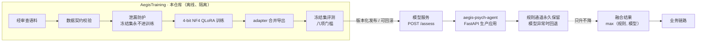

<div align="center">

# AegisTraining

**Aegis 校园心理支持系统的隔离训练工程 —— 数据契约 · QLoRA 微调 · 冻结集验收 · 版本化发布**

[](LICENSE)
[](https://www.python.org/)
[](https://huggingface.co/Qwen/Qwen3.5-2B-Base)
[](training/configs/risk_qlora_4060.yaml)
[](#41-v9-验收结果)
[](training/README.md)

</div>

---

## 快速导航

| 我想… | 直接去这里 |
| :--- | :--- |
| 30 秒了解这个项目做什么 | [项目简介](#1-项目简介) |
| 看懂它和线上系统怎么协作 | [系统边界与架构](#2-系统边界与架构) |
| 从零跑通一次训练 | [快速开始](#3-快速开始) |
| 看模型到底好在哪、达标了吗 | [验收结果](#41-v9-验收结果) |
| 找某个文件 / 某份文档 | [目录结构](#5-目录结构) · [文档索引](#6-文档索引) |
| 提 PR / 加数据 / 报问题 | [贡献指南](#7-贡献指南) |
| 确认能不能商用、有什么风险 | [安全与伦理](#8-安全与伦理边界) · [许可证](#9-许可证) |

---

## 1. 项目简介

### 1.1 它解决什么问题

校园心理支持系统每天会收到大量消息，其中极少数隐藏自伤 / 自杀风险。规则引擎能抓住显式表达，但对**隐喻式表达**（"想消失""要是没出生过就好了""活着就是拖累"）容易漏报。

本仓库训练一个专用小模型作为规则引擎的**增强器**：输入一条用户消息，输出一个 JSON 风险等级（`low` / `medium` / `high`），与规则结果融合后交给业务链路。

> **English summary.** `AegisTraining` is the isolated training workspace behind the Aegis campus mental-health support agent. It builds an audited Chinese risk-classification dataset, fine-tunes `Qwen/Qwen3.5-2B-Base` with 4-bit NF4 QLoRA on a single 8 GB GPU, and gates every release against a frozen 87-case holdout plus eight hard acceptance thresholds. The production FastAPI application lives in [`aegis-psych-agent`](https://github.com/shangguanyunji663/aegis-psych-agent) and talks to the model only through a protected HTTP/JSON contract — training code, GPU dependencies and experimental weights never cross that boundary.

### 1.2 当前版本一瞥

| 项目 | 值 |
| :--- | :--- |
| 当前模型版本 | `aegis-risk-qwen3.5-2b-v9` |
| 数据集 / 提示词契约 | `risk_sft_v9`（2867 train / 200 dev / 1414 devtest） · 契约 `v2` |
| 基座模型 | `Qwen/Qwen3.5-2B-Base` @ `b1485b2f` |
| 训练配置 | LoRA r=8 / α=16 · 4-bit NF4 + double quant · BF16 · cutoff 512 |
| 可训练参数 | 8,409,600 / 1,890,234,688（约 **0.44%**） |
| 训练开销 | 540 steps · 约 2h54m · 峰值显存 **4.9 GB**（RTX 4060 Laptop 8GB） |
| 状态 | `release-candidate` —— 门槛全过，未完成发布审批，生产开关默认关闭 |

### 1.3 核心能力

| 能力 | 说明 | 代码入口 |
| :--- | :--- | :--- |
| 数据契约校验 | 统一 schema、`reason ≤ 20` 字、标签合法性、来源与标注方式可追溯 | [`data_contract.py`](training/src/aegis_training/data_contract.py) |
| 泄漏防护 | 冻结集精确哈希 + 近重复检测（阈值 0.82），命中即拒绝进入 train/dev | [`leakage_guard.py`](training/src/aegis_training/leakage_guard.py) |
| 基座 gate | 训练前校验本地快照结构、层数与权重清单，拒绝把推理工件当可训练 checkpoint | [`base_model_gate.py`](training/src/aegis_training/base_model_gate.py) |
| 弱标注映射 | 外部语料风险标签映射与主体判定（自身 / 第三人称 / 虚构） | [`source_ingest.py`](training/src/aegis_training/source_ingest.py) |
| QLoRA 训练 | 4-bit NF4 量化 + LoRA，先 dry-run 校验环境再启动，产出版本化 adapter | [`train_risk_qlora.py`](training/scripts/train_risk_qlora.py) |
| 合并与导出 | adapter 合并为完整权重，输出版本化目录与 manifest | [`merge_risk_qlora.py`](training/scripts/merge_risk_qlora.py) |
| 离线评测 | 冻结 holdout 八门槛 + devtest 辅助口径，输出 JSON 报告 | [`eval_risk_qlora.py`](training/scripts/eval_risk_qlora.py) |
| 本地推理服务 | 本机 smoke test 用的 `POST /assess` 服务 | [`serve_risk_qlora.py`](training/scripts/serve_risk_qlora.py) |

---

## 2. 系统边界与架构



**边界为什么必须存在**：训练依赖（PyTorch、CUDA、bitsandbytes）体积巨大且版本敏感，混入生产进程会让部署体积、启动时间和故障面失控；更关键的是，训练中的模型属于**未验收的实验资产**，不应与对外服务共存。

| 位置 | 内容 |
| :--- | :--- |
| [`aegis-psych-agent`](https://github.com/shangguanyunji663/aegis-psych-agent) | FastAPI 应用、Agent / RAG / 工具治理、前端、测试与部署 |
| `AegisTraining`（本仓库） | 训练源码、数据契约、训练配置、离线评测、审计文档 |
| 外部模型存储 | 基座快照、adapter、merged 权重与其他大工件 |

> ⚠️ 本仓库**不提交**基座模型、merged 模型、checkpoint、GGUF、HF cache、CUDA 环境、原始数据、运行日志或中间产物。请勿使用 `git add -f` 绕过 `.gitignore`。

---

## 3. 快速开始

### 3.1 前置条件

| 类别 | 要求 |
| :--- | :--- |
| 操作系统 | Windows（文档示例为 `cmd.exe` 语法）；Linux / macOS 需替换路径与续行符 |
| Python | 3.11（建议使用独立虚拟环境，勿复用生产项目环境） |
| GPU | NVIDIA 8 GB 显存级别即可（实测峰值 4.9 GB）；需与本机驱动匹配的 CUDA 版 PyTorch |
| 基座模型 | 人工从官方来源下载固定 revision 的 `Qwen3.5-2B-Base` 快照，本仓库不包含 |
| 数据 | 已完成授权、脱敏、许可证与公开范围审查的语料 |

### 3.2 安装

```bat
python -m venv envs\qlora-qwen35
envs\qlora-qwen35\Scripts\python.exe -m pip install --upgrade pip
envs\qlora-qwen35\Scripts\python.exe -m pip install -r training\requirements-qlora.txt
```

PyTorch / CUDA wheel 需按本机驱动版本从官方渠道单独安装（依赖文件刻意不锁定，避免覆盖你的 CUDA 组合）。脚本会自动把 `training/src` 加入 `sys.path`，**无需**手动设置 `PYTHONPATH`。

<details>
<summary>PowerShell 用户看这里</summary>

把 `set X=Y` 换成 `$env:X="Y"`，把行尾续行符 `^` 换成反引号 `` ` ``：

```powershell
$env:AEGIS_TRAINING_ROOT="D:\AegisTraining"
python training\scripts\train_risk_qlora.py `
  --data-root "$env:AEGIS_TRAINING_ROOT\data\risk_sft_v9" `
  --snapshot-dir "$env:AEGIS_TRAINING_ROOT\models\Qwen3.5-2B-Base" `
  --dry-run
```

</details>

### 3.3 配置路径

脚本不依赖任何机器的硬编码绝对路径：

```bat
set AEGIS_TRAINING_ROOT=D:\AegisTraining
set AEGIS_PROJECT_ROOT=D:\PythonProject\aegis-psych-agent
set AEGIS_PROJECT_CORPUS=%AEGIS_PROJECT_ROOT%\eval\fixtures\representative_corpus.json
```

| 变量 | 作用 | 必需 |
| :--- | :--- | :--- |
| `AEGIS_TRAINING_ROOT` | 训练仓库与本地训练工件根目录 | 否（默认本 checkout） |
| `AEGIS_PROJECT_ROOT` | 生产仓库 checkout，只读其已提交的评测 fixture | 否 |
| `AEGIS_PROJECT_CORPUS` | 版本化评测语料路径；也可直接用 `--corpus` 传入 | 否 |

### 3.4 五步跑通

**① 准备数据**（当前推荐流程）

```bat
python training\scripts\prepare_risk_sft_v4.py ^
  --consolidated-root "%AEGIS_TRAINING_ROOT%\training\data\consolidated_risk_v1" ^
  --corpus "%AEGIS_PROJECT_CORPUS%" ^
  --output-root "%AEGIS_TRAINING_ROOT%\data\risk_sft_v9"
```

**② 先 dry-run 再训练** —— dry-run 会校验环境、基座 gate 与数据可读性，务必先跑

```bat
python training\scripts\train_risk_qlora.py ^
  --data-root "%AEGIS_TRAINING_ROOT%\data\risk_sft_v9" ^
  --snapshot-dir "%AEGIS_TRAINING_ROOT%\models\Qwen3.5-2B-Base" ^
  --dry-run

python training\scripts\train_risk_qlora.py ^
  --data-root "%AEGIS_TRAINING_ROOT%\data\risk_sft_v9" ^
  --snapshot-dir "%AEGIS_TRAINING_ROOT%\models\Qwen3.5-2B-Base" ^
  --output-root "%AEGIS_TRAINING_ROOT%\checkpoints\aegis-risk-qwen3.5-2b-v9"
```

> ⚠️ 必须显式传入版本化 `--output-root`。配置文件中的默认目录不含 `v9` 版本号，不能直接与下面的 merge 路径混用。

**③ 合并 adapter** —— 使用新的、空的、版本化输出目录

```bat
python training\scripts\merge_risk_qlora.py ^
  --snapshot-dir "%AEGIS_TRAINING_ROOT%\models\Qwen3.5-2B-Base" ^
  --adapter-dir "%AEGIS_TRAINING_ROOT%\checkpoints\aegis-risk-qwen3.5-2b-v9\adapter" ^
  --output-dir "%AEGIS_TRAINING_ROOT%\exports\aegis-risk-qwen3.5-2b-v9-merged"
```

**④ 离线评测**

```bat
python training\scripts\eval_risk_qlora.py ^
  --qlora-model-dir "%AEGIS_TRAINING_ROOT%\exports\aegis-risk-qwen3.5-2b-v9-merged" ^
  --output "%AEGIS_TRAINING_ROOT%\reports\risk-qlora-eval-v9.json"

python training\scripts\eval_risk_devtest.py ^
  --model-dir "%AEGIS_TRAINING_ROOT%\exports\aegis-risk-qwen3.5-2b-v9-merged" ^
  --test-jsonl "%AEGIS_TRAINING_ROOT%\data\risk_sft_v9\test.jsonl"
```

**⑤ 本地推理服务 smoke test**

```bat
python training\scripts\serve_risk_qlora.py ^
  --model-dir "%AEGIS_TRAINING_ROOT%\exports\aegis-risk-qwen3.5-2b-v9-merged" ^
  --host 127.0.0.1 --port 8301
```

> ⚠️ `127.0.0.1` 监听**仅用于隔离环境的本机 smoke test**。生产应用的服务端 URL 校验只允许 `http/https`，并拒绝 `localhost`、环回、私有与保留地址。生产部署必须使用经过审批的、可达且受保护的公网 HTTPS endpoint。

完整参数、故障排查、回滚与学习路径见 [`training/README.md`](training/README.md)。

---

## 4. 验收与发布

### 4.1 v9 验收结果

来源：[`reports/V9-TRAINING-EVAL-SUMMARY.md`](reports/V9-TRAINING-EVAL-SUMMARY.md)（2026-08-24）。八项冻结门槛**全部通过**：

| 门槛 | 阈值 | 结果 | |
| :--- | :--- | :--- | :---: |
| JSON 有效率 | ≥ 98% | 100% | ✅ |
| 合法风险标签率 | ≥ 99% | 100% | ✅ |
| `reason` 超 20 字比例 | = 0 | 0 | ✅ |
| `规则 ∪ 模型` HIGH recall | ≥ 规则基线 0.52 | 0.76 | ✅ |
| 隐喻隐式新增命中 | ≥ 4 / 25 | **+6**（13 → 19） | ✅ |
| 第三人称新增 high 误报 | ≤ 1 | 0 | ✅ |
| non-high → high FPR 增幅 | ≤ 2pp | **0** | ✅ |
| P95 延迟 | ≤ 8s | 0.95s | ✅ |

**辅助指标**（非门槛，用于横向对比）：

| 口径 | 指标 |
| :--- | :--- |
| 冻结 stress 87 | accuracy 0.782 · medium recall 0.882 · 第三人称准确率 0.818 · 误升级 0 条 |
| devtest 1414（开发参考） | accuracy 0.895 · high-F1 0.886 · FPR 0.050 · macro-F1 0.734 |

> **如实说明边界**：devtest 集上 medium-F1 0.380 低于上一版（0.496），该集 medium 以"探索型提问"为主，本版更倾向判 `low`。冻结验收口径下本版全面占优，但**冻结集并非独立盲测集**——其中的合成表达与仓库规则、测试存在共同设计背景，生产结论仍需外部专家审阅与完全隔离的测试集。

### 4.2 发布纪律

权重应发布到 Hugging Face、受控对象存储或经审查的 GitHub Release，**不进代码仓库**。每个发布版本必须记录：

- 模型 / adapter 版本与基座 revision
- 下载地址、许可证与 SHA-256 校验和
- 训练数据版本、提示词契约版本、验收报告
- 是否允许生产接入与回滚版本

模板见 [`docs/MODEL-RELEASES.md`](docs/MODEL-RELEASES.md)，当前候选版本的证据状态见 [`docs/V9-RELEASE-RECORD.md`](docs/V9-RELEASE-RECORD.md)。没有完整元数据的权重不视为可发布模型。

---

## 5. 目录结构

```text
.
├── training/
│   ├── src/aegis_training/   # 数据契约、泄漏防护、指标、基座 gate、路径工具
│   ├── scripts/              # 数据准备 / 训练 / 合并 / 评测 / 服务入口
│   ├── configs/              # 可复现实验配置（risk_qlora_4060.yaml）
│   ├── data/                 # 数据契约说明与经审查的小型样例
│   ├── docs/                 # 数据补充计划、可复现规范、服务运行手册
│   └── requirements-qlora.txt
├── tools/                    # legacy 检查工具；当前入口以 training/scripts/ 为准
├── docs/                     # 模型发布记录与发布计划
├── reports/                  # 唯一报告目录，只保留经审查的轻量摘要
├── external-data/            # 被忽略的外部数据 checkout（仅旧流程使用）
├── LICENSE                   # Apache-2.0
└── README.md
```

被 `.gitignore` 排除、不在仓库中的本地工件：`models/`（基座快照）、`checkpoints/`、`exports/`、`data/` 生成集、`envs/`、`hf-cache/`。

---

## 6. 文档索引

| 文档 | 适用读者 | 内容 |
| :--- | :--- | :--- |
| [`training/README.md`](training/README.md) | 所有人 | 操作主手册兼学习手册：背景、参数、训练、评测、服务、回滚、排障 |
| [`training/data/README.md`](training/data/README.md) | 数据 / 标注 | 数据格式、标签规范、来源追溯、holdout 规则 |
| [`training/docs/REPRODUCIBILITY.md`](training/docs/REPRODUCIBILITY.md) | 复现 / 审计 | 可复现要求与证据记录规范 |
| [`training/docs/SERVICE-RUNBOOK.md`](training/docs/SERVICE-RUNBOOK.md) | 运维 | QLoRA 推理服务运行手册 |
| [`training/docs/DATA-SUPPLEMENT-PLAN.md`](training/docs/DATA-SUPPLEMENT-PLAN.md) | 数据 | 数据补充计划 |
| [`docs/MODEL-RELEASES.md`](docs/MODEL-RELEASES.md) | 发布负责人 | 模型发布记录模板 |
| [`docs/V9-RELEASE-RECORD.md`](docs/V9-RELEASE-RECORD.md) | 审计 | v9 发布证据状态（release-candidate） |
| [`reports/TRAINING-HISTORY-INDEX.md`](reports/TRAINING-HISTORY-INDEX.md) | 所有人 | 训练谱系与版本映射 |

---

## 7. 贡献指南

欢迎提交 Issue 与 PR。这是个**安全第一**的项目，下面几条是硬约束。

### 7.1 工作流

1. Fork 仓库，基于 `main` 建分支：`feat/xxx` / `fix/xxx` / `docs/xxx`。
2. 本地在独立虚拟环境中验证（不要用生产项目环境）。
3. 涉及训练或数据的改动，附上可复现证据：配置文件、manifest、评测报告摘要。
4. 提交 PR 时说明：动机、改动范围、验证方式与已知局限。

### 7.2 数据与模型的硬门禁

- 心理健康、自杀与风险识别语料**必须先完成**授权、脱敏、许可证和公开范围审查；未通过审查的数据只留在受控本地目录。
- 不得把弱标注写成"人工批准"——`label_method` 与 `review_status` 必须如实描述来源质量。
- 冻结 holdout（`stress` 87 条）永不进入训练；任何改动不得削弱泄漏防护。
- 不提交权重、原始数据、密钥、运行日志；补 `.gitignore` 只能阻止未来跟踪，无法清除已有 Git 历史中的大文件。

### 7.3 提交前检查

不要直接 `git add .`，逐项确认：

```bash
git status --short
git ls-files
git ls-files -z | xargs -0 -n1 git check-ignore -v --no-index 2>/dev/null
```

若历史已包含大文件或敏感信息，需单独规划历史清理与远端重写。

### 7.4 报告问题

提交 Issue 时请附：操作系统与 Python 版本、GPU 与 CUDA 版本、完整命令、错误栈、以及去掉敏感内容的最小复现。

---

## 8. 安全与伦理边界

- 训练模型只负责**风险等级 JSON 分类**，不能替代专业心理咨询或危机干预。
- 生产接入必须保留规则通道兜底，采用"只升不降"融合策略，模型异常时回退规则。
- 上线条件包括：冻结集达标、外部专家审阅、可回滚发布流程；当前 v9 生产开关 `RISK_QLORA_ENABLED` 默认关闭。
- 请勿将本仓库产出用于任何形式的高风险自动化决策（诊断、治疗、执法、内容封禁等）。

---

## 9. 许可证

- **代码**：[Apache License 2.0](LICENSE)。
- **基座模型**：`Qwen/Qwen3.5-2B-Base` 遵循其官方许可证，使用时需单独遵守。
- **训练数据**：各来源数据集遵循其各自许可证与授权范围；涉及人类受试者的语料需额外完成脱敏与公开范围审查。
- **模型权重**：不在本仓库分发。发布时必须附许可证、SHA-256 与训练数据版本，见 [§4.2 发布纪律](#42-发布纪律)。

---

<div align="center">

维护者：[@shangguanyunji663](https://github.com/shangguanyunji663) ｜ 生产应用：[aegis-psych-agent](https://github.com/shangguanyunji663/aegis-psych-agent)

如果这个项目对你有参考价值，欢迎 Star ⭐

</div>
